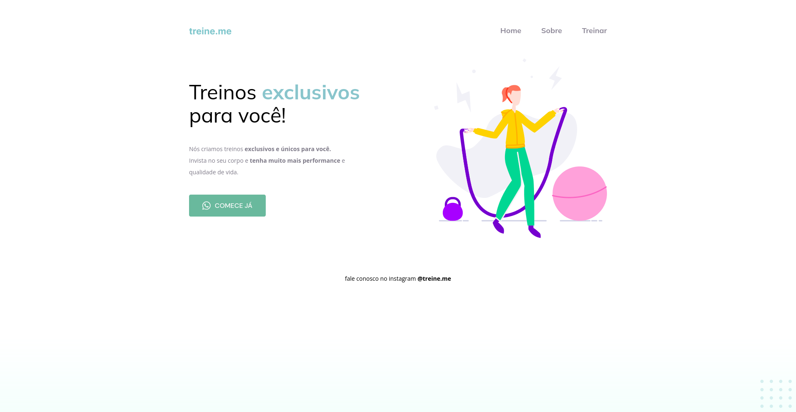

# Projeto 02 - Stage 02, Explorer.

Este é o segundo projeto do Stage 02 do programa Explorer da [RocketSeat](rocketseat.com.br/).

## Índice

- [Projeto](#TreineME)
  - [Screenshot](#screenshot)
  - [Tecnologias Utilizadas](#tecs)
  - [Autor](#autor)

## Treine.me

Este projeto é o resultado do conhecimento adquirido durante o Explorer, até o momento.  

### Páginas

Projeto Git - [Projeto](https://loreancarlos.github.io/Treine-Me/)

### O Desafio

- Recriar um layout completo.
    - Adicionar todos os elementos do projeto mantendo suas proporções.
    - Utilizar tags semânticas para melhor acessibilidade.
- Obs: As especificações do layout foram disponibilizadas pelo Figma.

### Screenshot

## Tecs

Tecnologias

- HTML
- CSS

Outras

- HTML5 - Tags Semânticas
- CSS - Display Flexbox

## Autor

- Linkedin - [Lorean Carlos](https://www.linkedin.com/in/lorean-carlos-fernandes-soares-03220121a/)
- Rocketseat - [Perfil](https://app.rocketseat.com.br/me/loreancarlos)